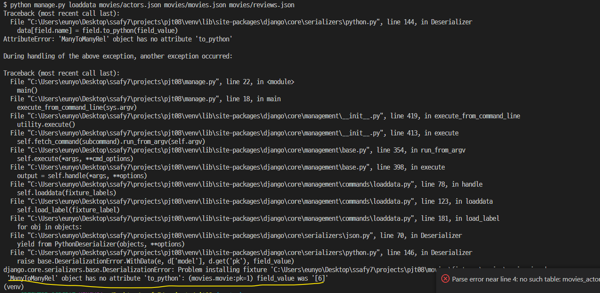

# pjt08

##### ❌ no attribute

- 명세서 속 ERD를 참고해서 `Movie`모델에 `actor`를 속성으로 했는데...아래와 같은 오류가 계속 났다.

- Actor class에 M:N 관계를 설정했는데 movies.json파일을 보면 actors 가 PK로 되어있기 떄문에 M:N을 무비로 옮겼다

❌ import error?

serializer 폴더안에 클래스.py 별로 관리를 했는데, 필요한 serializer 클래스들을 다른 파일에서 import하며 사용하다 보니 nameerror가 발생했다 ㅠ..

결국 그 폴더안에서 필요한 class serializer는 그 폴더안에서 새롭게 작성해서 사용했다 !!!!!! 필요할때마다 class새로 생성해서 사용하는것에 익숙해져야 한다!

